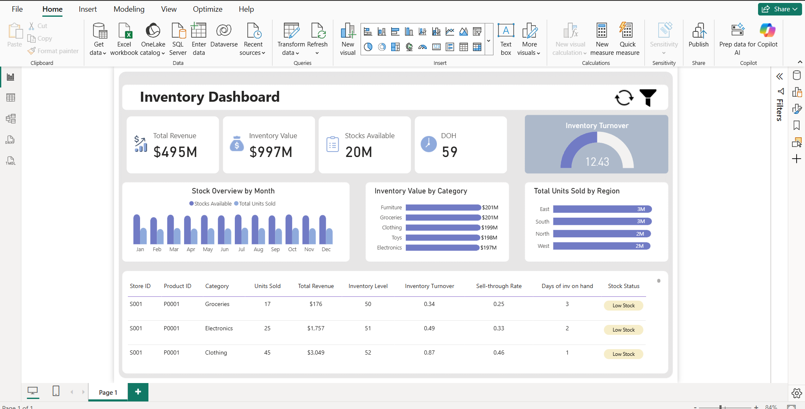

# Inventory Management Dashboard - Power BI

This project is a Power BI dashboard designed to analyze inventory performance, stock levels, and sales trends across different categories and regions.
The goal is to help businesses optimize inventory turnover, reduce stockouts, and make data-driven supply chain decisions.

---

## Key Features

* ✅ **Revenue and Inventory Metrics**
  Track total revenue, inventory value, available stock, and Days on Hand (DOH).

* ✅ **Inventory Turnover Analysis**
  Measure turnover ratio to evaluate efficiency of stock movement.

* ✅ **Stock Overview by Month**
  Compare monthly stock availability with units sold for demand planning.

* ✅ **Category-wise Inventory Value**
  Break down inventory value across categories like furniture, groceries, clothing, toys, and electronics.

* ✅ **Regional Sales Insights**
  Analyze total units sold across different regions (East, South, North, West).

* ✅ **Detailed Inventory Table**
  View store- and product-level insights including revenue, turnover, sell-through rate, and stock status (Low/High Stock).

---

## Project Files

* `Inventory_Management_Dashboard.pbix` – Power BI file containing the complete dashboard
* `Dataset/` – Sample datasets with product, category, and sales data
* `README.md` – Documentation file with project overview and usage instructions

---

## Use Case

This dashboard is useful for:

* **Retailers** – Optimize stock management and track sales performance
* **Inventory Managers** – Identify low stock items and avoid overstocking
* **Business Analysts** – Gain insights into sales trends and stock turnover
* **Decision Makers** – Monitor financial impact of inventory performance

---

## Tech Stack

* **Power BI Desktop** – for creating visual reports
* **DAX** – for calculations like turnover ratio, sell-through rate, and DOH
* **Excel / CSV datasets** – containing product, store, and sales data

---

## Screenshot

---

## How to Use

1. Download the `.pbix` file from this repository
2. Open the file in **Power BI Desktop**
3. Load or connect the provided dataset
4. Interact with filters and visuals to analyze stock and sales insights

---

## License

This project is shared for portfolio and learning purposes.
You are welcome to fork, explore, and extend it.

---

## Author

**Sayed Ibrahim**
Data Analyst | Power BI Developer

Connect on [LinkedIn](https://www.linkedin.com/in/sayed-ibrahim-m)
